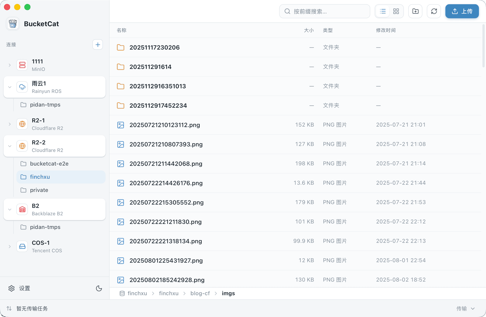

<p align="center">
  
</p>

<h1 align="center">BucketCat</h1>

<p align="center">简单漂亮的跨平台对象存储客户端</p>

<p align="center">
  
  
  
  
  
</p>

<p align="center"><b>简体中文</b> · <a href="README.en.md">English</a> · <a href="https://deepwiki.com/finch-xu/BucketCat">DeepWiki</a> · <a href="https://bucketcat.pidan.dev/">官方网站 bucketcat.pidan.dev</a></p>

---

<p align="center">
  
</p>

## 功能特性

- **一站接入主流对象存储** — 内置九家服务商预设（见下方[支持的对象存储](#支持的对象存储)），也支持接入任意 S3 兼容服务。

- **大文件分片并发传输** — 超过 16 MiB 的文件自动分片，分片大小随文件体积自适应，上传与下载均以多分片并发进行。

- **断点续传** — 传输进度以 checkpoint 原子落盘，下载中途写入独立的 `.bcpart` 暂存文件、全部分片到位后才原子改名；应用重启后可从断点继续，不必从头再来。

- **传输任务全程可控** — 暂停、继续、取消、重试随时可用，实时显示进度、速度与剩余时间，并可调整同时进行的任务数与单任务并发分片数。


## 支持的对象存储

新建连接时从下表挑一家，端点和地域会自动填好，只需填 Access Key 与 Secret Key。

| 服务商 | 说明 |
| --- | --- |
| Amazon S3 | |
| Cloudflare R2 | 填账号 ID 即可，端点自动生成 |
| MinIO | 自建，填自己的服务地址 |
| [RustFS](https://github.com/rustfs/rustfs) | 自建，填自己的服务地址 |
| 阿里云 OSS | 按地域选择端点 |
| 腾讯云 COS | 一条连接对应一个地域，跨地域请分别新建 |
| 七牛云 Kodo | 按地域选择端点 |
| [雨云 ROS](https://www.rainyun.com/ODA1MzUy_?s=bucketcat) | 按地域选择端点 |
| Backblaze B2 | 需用应用密钥（非主密钥），地区自动识别 |
| 通用 S3 兼容 | 上面没有的服务，手填端点和地域即可接入 |

## 下载安装

到 [Releases](https://github.com/finch-xu/BucketCat/releases/latest) 页面下载对应系统的安装包。

**macOS** — Apple Silicon 下 `bucketcat_macOS-arm64.dmg`，Intel 下 `bucketcat_macOS-x64.dmg`。打开 dmg 把 BucketCat 拖进「应用程序」即可。安装包已做签名与公证，不会被 Gatekeeper 拦。

**Windows** — 下载 `bucketcat_windows-x64-setup.exe`（ARM 设备用 `bucketcat_windows-arm64-setup.exe`），双击安装。安装包尚未购买代码签名证书，首次运行 SmartScreen 会弹提示，点「更多信息」→「仍要运行」即可。

**Linux** — `bucketcat_linux-x64.AppImage` 下载后 `chmod +x` 直接运行；也提供 `bucketcat_linux-x64.deb`。

装好之后，应用每次启动会检查一次新版本，有更新时在设置入口标一个小红点，不弹窗也不会自动下载；在「设置 › 更新」里可以手动检查并一键安装（deb 安装的用户请走包管理器更新）。

## 开发

需要 Node 22+、pnpm 9+、Rust 1.94.1+。Linux 上另需 `libwebkit2gtk-4.1-dev`、`librsvg2-dev`、`libayatana-appindicator3-dev`、`patchelf`。

```bash
pnpm install          # 安装前端依赖
pnpm tauri dev        # 启动开发环境（前端热更新 + Rust 后端）
pnpm test             # 前端单元测试（Vitest）
pnpm tauri build      # 打本地安装包
```

后端测试在 `src-tauri` 目录下跑 `cargo test`。各服务商的 e2e 测试默认跳过，需要真实账号或本地容器，运行方式见 `src-tauri/tests/*_e2e.rs` 文件顶部的注释。


## License

Licensed under the [Apache License, Version 2.0](LICENSE).

Copyright 2026 虚拟世界的懒猫
